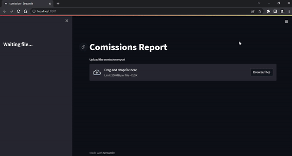

# RPA-comission-report

In this project we used Streamlit as a local application to run an automation service using Python.

Most departments have repetitive tasks with no aggregated value that could be eliminated with automation. These automations are created with the sole intention to help people focus on the important tasks, that are aggregating value to the company.

That is how this project was born! A colleague approached our department looking for a solution to his problem. 
Problem: “Every month I have to take the commissions excel sheet, filter it for each seller, create a new file and then email this file to the seller. Since we have dozens of sellers this task takes a lot of time and it basically lost time.”

So, using Python and its libraries we were able to build this application.
Solution: He is going to upload the commissions excel sheet, select all the variables of the process as inputs. Like the columns with the information, the dates in the email and the email itself. We pre-loaded all the default inputs, so he wouldn’t have to pick this information every time. So essentially all he has to do is to upload the commissions excel and click a button.

Below we have a short gif of the application running.

And here we have the result.

